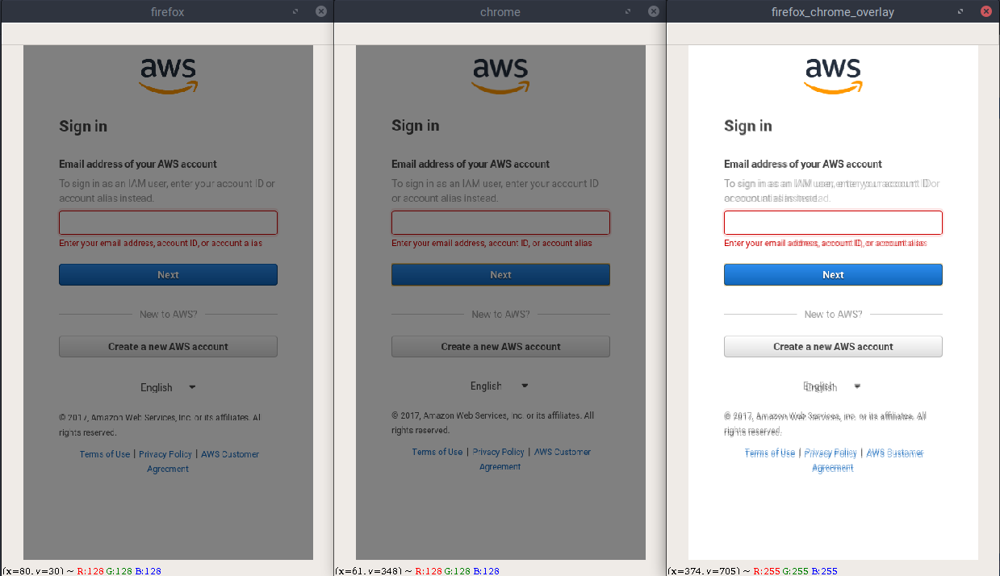
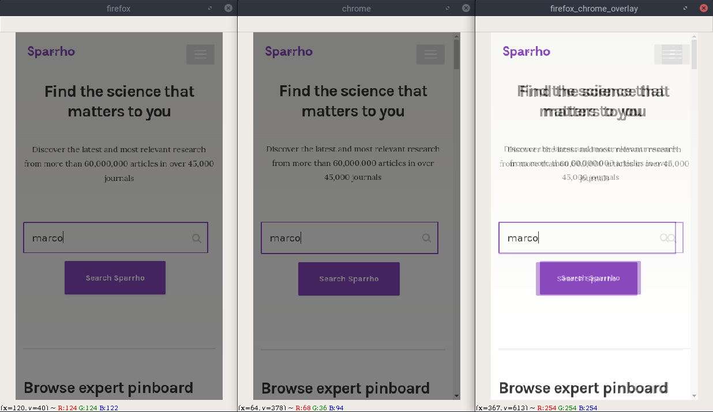
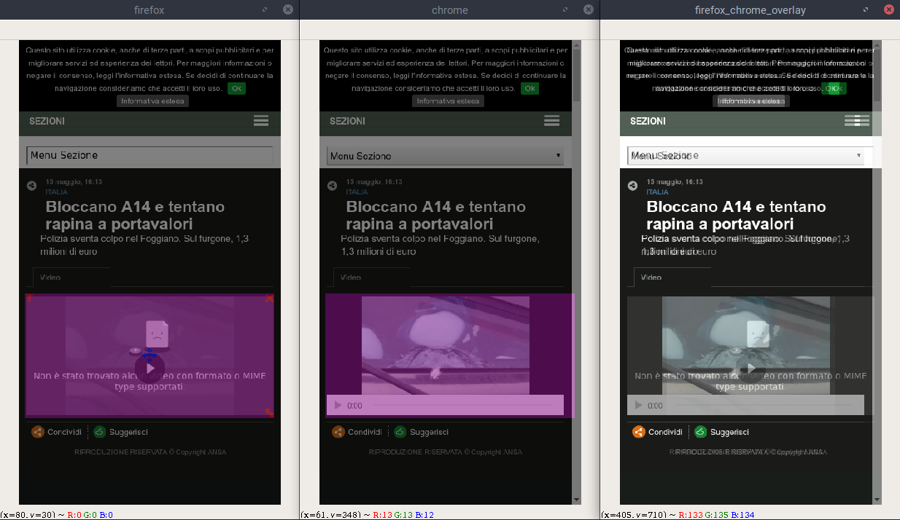
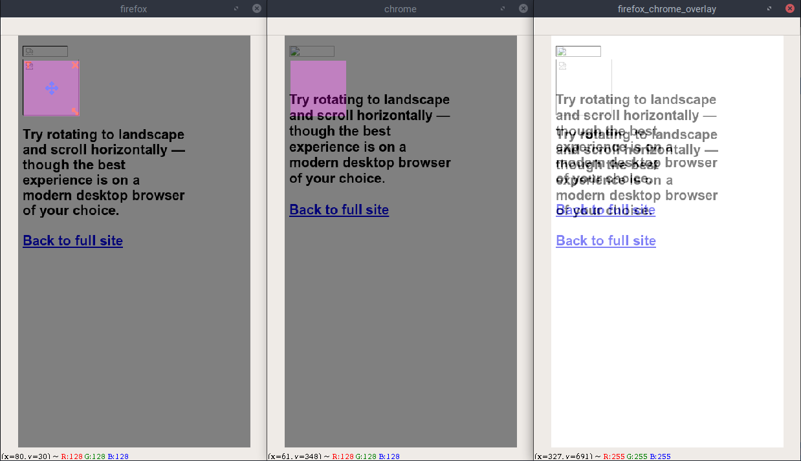
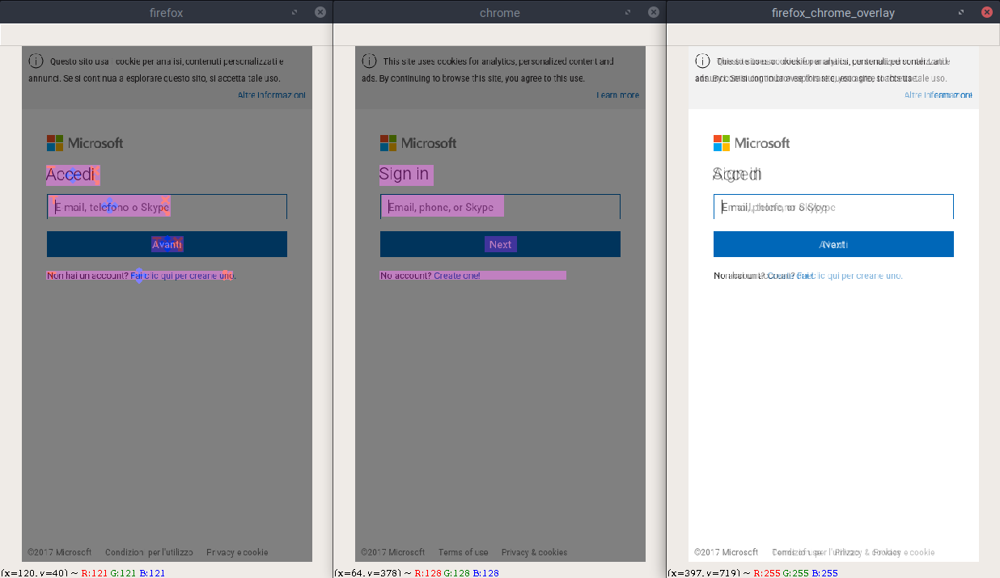

# Labeling Guidelines

Now that the screenshots are available, they need to be labeled. The labeling phase operates on couples of comparable screenshots.

## Images marked as compatible - y 
---
#### Couples of images that are clearly compatible.
#### They look the same.
#### firefox\_chrome\_overlay window should nearly overlap them.
---

## Bounding boxes marked as incompatible - n 
---
#### Couples of images which are not compatible
#### They are different.
#### Mark the parts which are logically different.
> For example, improper loading of images, missing text, different design, different languages, different selections, missing bullets or checkboxes and others are marked incompatible.
---

## Bounding boxes marked as different yet compatible - d 
---
#### Couples of images that are compatible, but with content differences.
#### They look different.
#### Mark the parts which are logically the same.
>Since the screenshots are taken at different times in the two browsers, there are differences which are not incompatibilities but are actually due to the different timing. For example, a banner could be showing a different advertisement, a video could be in two different frames, a clock could be showing different time, a captcha could be showing different characters or images, two news could be different, and so on.
---

In the training phase, the best case is that we are able to detect between **Y + D and N**. If we are not able to do that, we should at least aim for the relaxed problem of detecting between **Y and D + N**. This is why we have this three labeling system.