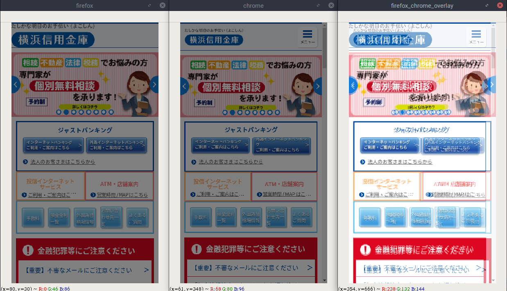
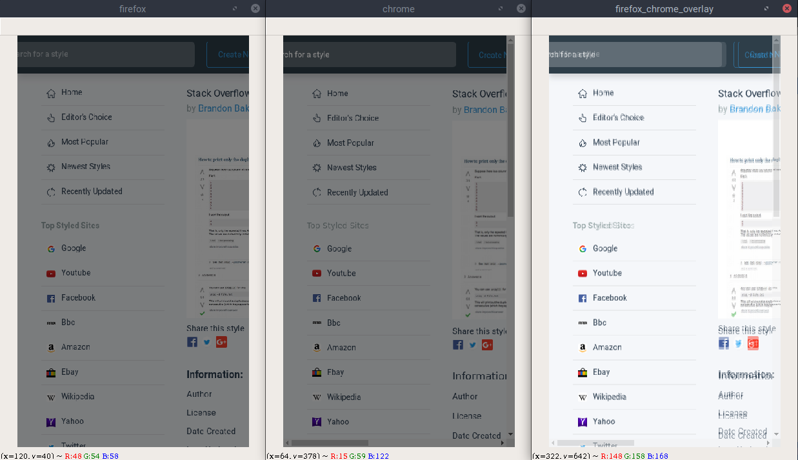
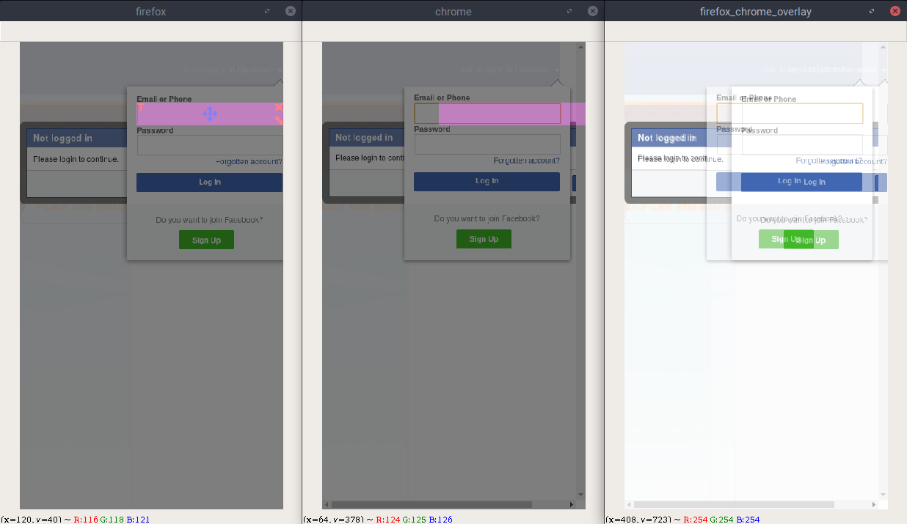
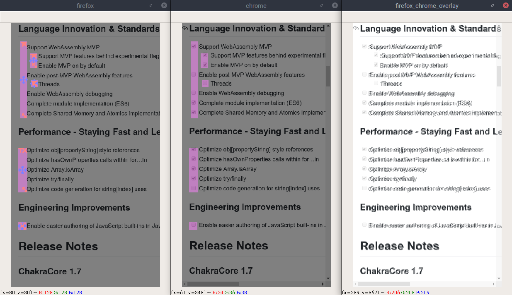
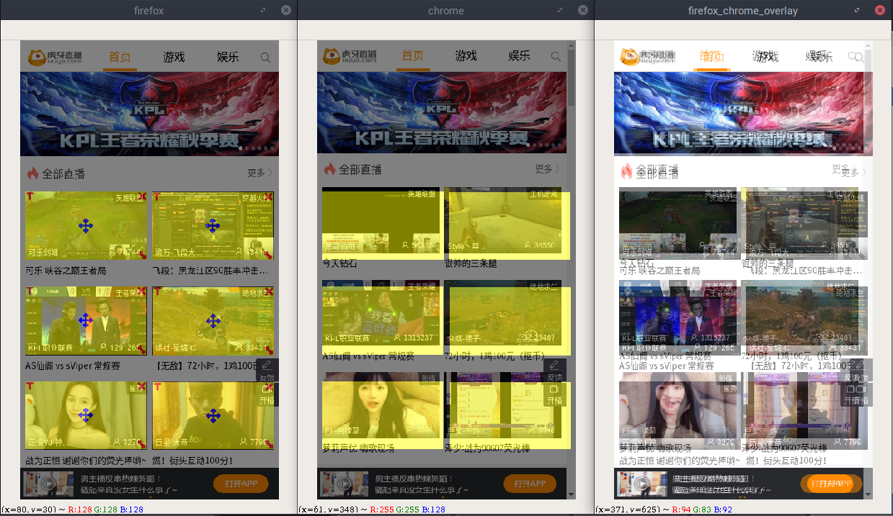

# Labeling Guidelines

## Images marked as compatible - y 
---
#### They look the same.
#### firefox\_chrome\_overlay window should nearly overlap them.
---

## Bounding boxes marked as incompatible - n 
---
#### They are different.
#### Mark the parts which are logically different.
> Improper loading of images, missing text, different design, different languages are marked incompatible.
---

## Bounding boxes marked as different yet compatible - d 
---
#### They look different.
#### Mark the parts which are logically the same.
>Different advertisements, different videos loaded, time-in-clock are marked
as different yet compatible.
---

